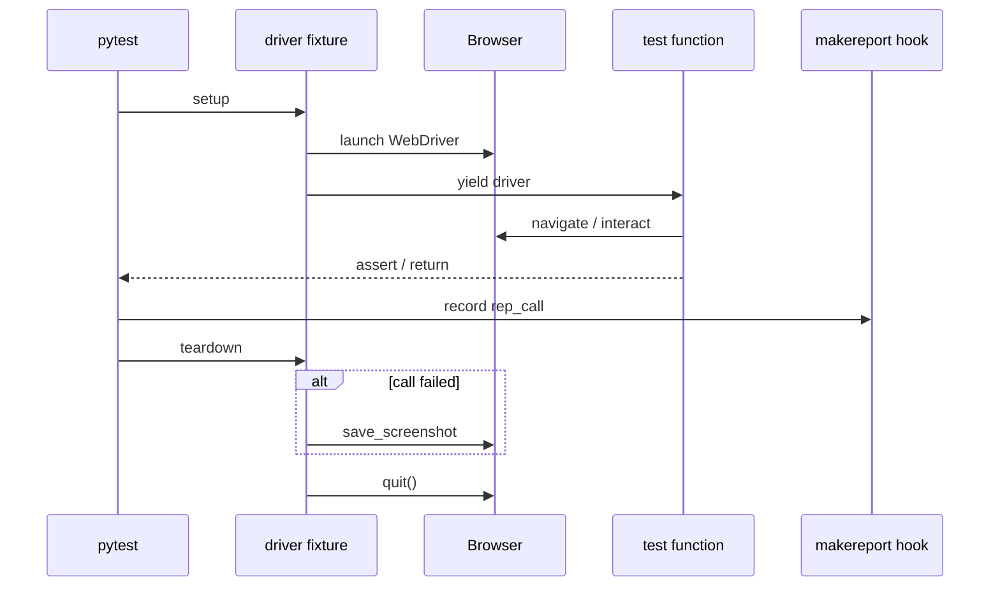
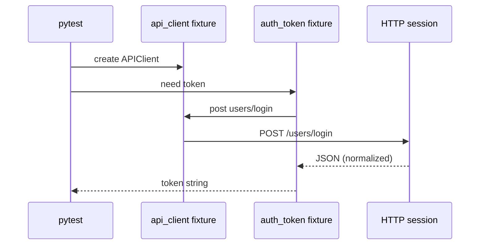
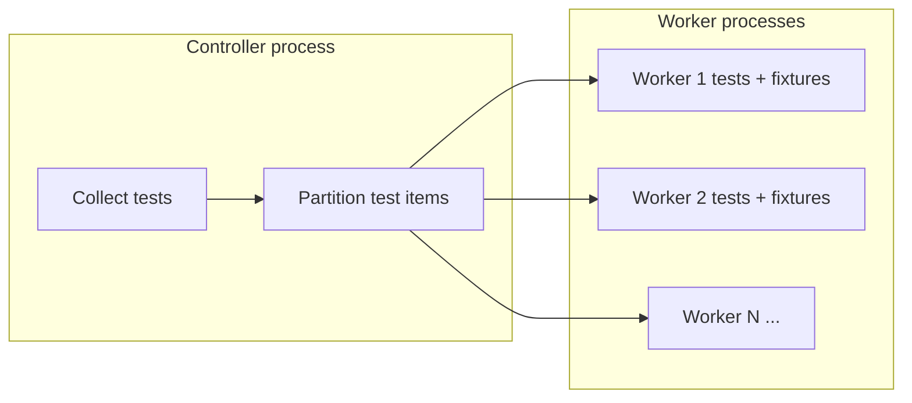

# Project Detailed Explanation — Training & Onboarding Manual

**Audience:** New QA automation engineers and anyone who needs **line-by-line mental model** of this repository.  
**Read first:** [README.md](README.md) (setup, commands).  
**Architecture (concise):** [FRAMEWORK_ARCHITECTURE.md](FRAMEWORK_ARCHITECTURE.md).  
**Per-test encyclopedia:** [TEST_CASE_DETAILED_EXPLANATION.md](TEST_CASE_DETAILED_EXPLANATION.md).  
**Notes UI deep maintainer:** [notes_handbook.md](notes_handbook.md).

---

## Table of contents

1. [How this framework works internally](#how-this-framework-works-internally)
2. [Concept map](#concept-map)
3. [Pytest configuration profiles](#pytest-configuration-profiles)
4. [File-by-file deep dives](#file-by-file-deep-dives)
5. [Page objects in depth (Selenium)](#page-objects-in-depth-selenium)
6. [API layer in depth](#api-layer-in-depth)
7. [Test modules — patterns and behavior](#test-modules--patterns-and-behavior)
8. [Utilities beyond core three](#utilities-beyond-core-three)
9. [Batch scripts and stability workflows](#batch-scripts-and-stability-workflows)
10. [Diagrams — lifecycles](#diagrams--lifecycles)
11. [How to safely modify the framework](#how-to-safely-modify-the-framework)
12. [Debugging techniques](#debugging-techniques)
13. [Beginner vs maintainer notes](#beginner-vs-maintainer-notes)

---

## How this framework works internally

This section answers: *What happens after I type `python -m pytest -c pytest_ui.ini`?*

### 1) What happens from the moment the user runs pytest

| Step | What happens |
|------|----------------|
| 1 | Python starts **pytest** as a module (`python -m pytest`). |
| 2 | Pytest loads **`pytest.ini`** or the **`-c`** file (`pytest_ui.ini`, etc.). |
| 3 | Pytest loads **plugins** declared in the environment (`pytest-xdist`, `pytest-html`, `pytest-rerunfailures`). |
| 4 | Pytest discovers and loads **`conftest.py`** at the project root (and nested `conftest.py` files under test packages). |
| 5 | Hook **`pytest_configure`** runs **before** collection finishes — our root `conftest.py` injects **timestamped** HTML path and **log file** path (see snippet below). |
| 6 | **Collection:** pytest imports test modules under `testpaths` and registers `test_*` functions (and any classes if present). |
| 7 | If **xdist** is active (`-n` > 0), a **controller** process forks **worker** processes; each worker runs a subset of tests. |
| 8 | For each scheduled test item, pytest builds a **fixture dependency graph** and executes fixtures in dependency order. |
| 9 | The **test body** runs; assertions execute (pytest may rewrite `assert` for clearer messages). |
| 10 | Hooks record **setup/call/teardown** outcomes; fixtures tear down in reverse order; **HTML** and **logs** are finalized on exit. |

**Hook evidence (report + log path injection):**

```51:96:conftest.py
def pytest_configure(config):
    """
    Runs early at pytest startup (before collection).
    Injects a timestamped --html report path and log_file path so that
    every test run produces uniquely named output files under reports/.
    ...
    """
    ini_file = config.inifile
    if ini_file:
        name = os.path.basename(str(ini_file))
        prefix = name.replace("pytest_", "").replace(".ini", "")
    else:
        prefix = "all"
    timestamp = datetime.now().strftime("%Y-%m-%d_%H-%M-%S")
    ...
    if config.pluginmanager.hasplugin("html"):
        if not config.option.__dict__.get("htmlpath"):
            config.option.htmlpath = html_path
            config.option.self_contained_html = True
    log_path = os.path.join(reports_dir, f"{prefix}_log_{timestamp}.txt")
    config.inicfg["log_file"] = log_path
```

> **Beginner note:** When you pass **`-c pytest_ui.ini`**, the prefix becomes **`ui`**, so you get `ui_report_<timestamp>.html`. When you use **default** `pytest.ini`, the basename becomes `pytest.ini` → after string replace the prefix is **`ini`** (unusual filename — prefer explicit `-c pytest_all.ini` for clearer report names).

---

### 2) How pytest discovers tests

- **`testpaths`** in the active INI restricts where collection starts (for example only `tests/ui`).
- Pytest collects **functions named `test_*`** and **classes named `Test*`** (this project mostly uses **plain functions**).
- **Markers** (`@pytest.mark.smoke`, etc.) are **declared** in INI and **applied** on tests — you can run subsets with `-m`.

---

### 3) How fixtures load

**Order of execution for a typical UI test:**

1. **Session-scoped autouse** `log_browser_choice` runs once per worker session.
2. **Function-scoped autouse** `setup_teardown` enters SETUP logging.
3. **`driver` fixture** setup: launch browser, apply timeouts, `yield` driver to test.
4. **Test runs** — may call page objects.
5. **`driver` fixture** teardown: screenshot on failure, `quit()`.
6. **`setup_teardown`** TEARDOWN log.

If the test also requests **`auth_token`**, pytest ensures **`api_client`** is created first because **`auth_token`** lists `api_client` as a parameter.

---

### 4) How the browser launches

All browser creation is centralized in **`driver`** in root `conftest.py`:

- Reads **`--browser`** from CLI if set; else **`[browser] browser`** from `config.ini`.
- Reads **`headless`** flag.
- Sets **`page_load_strategy = "eager"`** so `driver.get()` returns earlier — **critical** for React SPAs where DOM continues to populate.
- Applies **`implicitly_wait`** and **`set_page_load_timeout`** from `[timeouts]`.

There is **no** automatic navigation to the app root — each **`Page.open()`** performs `driver.get(self.URL)` (or skips `get` when already on the app, in `NotesPage.open()`).

---

### 5) How page objects work

- Tests receive **`driver`** and pass it into **`SomePage(driver)`**.
- **`BasePage.__init__`** stores `driver`, creates a **logger**, reads **`explicit_wait`** from config for `WebDriverWait` defaults.
- Page methods **encapsulate** locators and user flows so tests read like scenarios, not raw Selenium.

---

### 6) How Selenium communicates with the browser

- **WebDriver protocol:** Selenium sends commands to **ChromeDriver** / **GeckoDriver**, which control the browser.
- **`find_element` / `click` / `send_keys`:** become driver commands.
- **`execute_script`:** runs JavaScript **in the page context** — used for **JS clicks**, **overlay dismissal**, **scrollIntoView**, and **native value setters** for React-controlled inputs on the Notes page.

---

### 7) How API tests execute

- Tests use the **`api_client`** fixture → new **`APIClient`** per test.
- **`APIClient`** uses **`requests.Session`** with default headers.
- Responses are wrapped in **`_ResponseProxy`** so **`resp.json()`** matches what assertions expect (nested `data` promoted or list returned).

---

### 8) How reports are generated

- **pytest-html** writes HTML after the run using the path chosen in **`pytest_configure`** or passed on CLI (`--html=...`).
- **`self_contained_html = True`** embeds assets so a single `.html` file is portable.

---

### 9) How screenshots are captured

After the test **call** phase, **`pytest_runtest_makereport`** attaches **`rep_call`** to the item. The **`driver`** fixture teardown checks:

```230:241:conftest.py
    if hasattr(request.node, "rep_call") and request.node.rep_call.failed:
        screenshots_dir = os.path.join(os.path.dirname(__file__), "reports", "screenshots")
        os.makedirs(screenshots_dir, exist_ok=True)
        screenshot_path = os.path.join(screenshots_dir, f"{request.node.name}.png")
        ...
        web_driver.save_screenshot(screenshot_path)
```

> **Important:** Screenshots are taken **before** `quit()`. If the browser crashed earlier, screenshot may fail silently only if exceptions propagate — current code logs and saves when driver is alive.

---

### 10) How xdist parallelism works internally (simplified)

- **Main process** collects tests and partitions them across **N workers**.
- Each **worker** is a **separate Python process** with its own imported modules and fixtures.
- **Each UI test** still gets its **own** `driver` instance **inside that worker**.
- **Shared state risks:** global variables, shared files, and **shared SaaS accounts** are not magically isolated — tests must be written to tolerate parallel mutations or you lower `-n`.

---

## Concept map

| Term | Meaning in this repo |
|------|----------------------|
| **Fixture** | A function pytest calls to **inject** dependencies (`driver`, etc.) |
| **POM** | Page Object Model — `pages/*.py` wrap the DOM |
| **`read_config`** | Reads **one** key from `config/config.ini` **each call** |
| **`auth_token`** | String token from login API for authenticated requests in API tests |
| **Stability profile** | `pytest_stability.ini`: **parallel `-n 4`**, **no reruns** |

---

## Pytest configuration profiles

| File | Purpose |
|------|---------|
| `pytest.ini` | Default project-wide options when you run without `-c` |
| `pytest_ui.ini` | UI-only `testpaths`, reruns |
| `pytest_api.ini` | API-only `testpaths`, reruns |
| `pytest_all.ini` | Full tree + `-n auto` + reruns |
| `pytest_stability.ini` | Full tree + **`-n 4`** **without** reruns |

Markers are registered in each profile (see `markers =` sections) and used heavily in `tests/**/*.py`.

---

## File-by-file deep dives

Each important file below follows this pattern:

1. Purpose  
2. Why the framework needs it  
3. When it executes  
4. What depends on it / what it depends on  
5. What it exposes  
6. Internal execution flow (summary)  
7. How pytest interacts  
8. Common mistakes  
9. Warnings  
10. Example execution flow  
11. Beginner-friendly summary  
12. Advanced summary  
13. Runtime impact  
14. Why this approach  
15. Risks if changed incorrectly  

---

### `conftest.py` (project root)

| # | Detail |
|---|--------|
| **1. Purpose** | Register **global fixtures** and **pytest hooks** for UI/API tests. |
| **2. Why required** | Without it, there is no shared `driver`, no `api_client`, no automatic reports/logs, no failure screenshots. |
| **3. When it runs** | Loaded **once per pytest process** at startup; hooks run at defined pytest phases. |
| **4. Dependencies** | **Used by:** all tests under `tests/`. **Imports:** `utilities/*`, Selenium, `webdriver_manager`. |
| **5. Exposes** | Fixtures: `log_browser_choice`, `config`, `driver`, `api_client`, `auth_token`, `setup_teardown`. Hooks: `pytest_configure`, `pytest_html_report_title`, `pytest_addoption`, `pytest_runtest_makereport`. |
| **6. Internal flow** | `pytest_configure` → paths → session autouse logs browser → per test: makereport wiring → autouse logs SETUP → driver startup → test → driver teardown (screenshot?) → quit → TEARDOWN log. |
| **7. Pytest interaction** | Pytest discovers `conftest.py` automatically; fixture names match test function parameters. |
| **8. Common mistakes** | Expecting **`driver`** to open the app automatically (it does not). Forgetting **`--browser`** only affects new sessions. |
| **9. Warnings** | `rep_call` must exist before teardown checks failure — hook ordering is **intentional** (`tryfirst=True`). |
| **10. Example flow** | `python -m pytest -c pytest_ui.ini tests/ui/test_login.py::test_valid_login -q` → configure → collect one test → driver created → `LoginPage(driver).open()` inside test → pass → no screenshot → quit. |
| **11. Beginner** | Think of `conftest.py` as **shared test infrastructure** wired into pytest’s plugin system. |
| **12. Advanced** | Hookwrapper `pytest_runtest_makereport` yields to other hooks then sets `item.rep_*` attributes consumed by fixtures — classic pytest pattern for teardown decisions. |
| **13. Runtime impact** | Browser start/stop dominates UI runtime; `webdriver-manager` may hit network on first driver download. |
| **14. Why** | Centralizes cross-cutting concerns so tests stay short and focused on behavior. |
| **15. Risks** | Changing fixture **scopes** without understanding xdist can cause **shared browser** bugs or **stale sessions**. |

**Key code references:**

```160:245:conftest.py
@pytest.fixture(scope="function")
def driver(request):
    ...
    yield web_driver
    if hasattr(request.node, "rep_call") and request.node.rep_call.failed:
        ...
        web_driver.save_screenshot(screenshot_path)
    ...
    web_driver.quit()
```

```259:276:conftest.py
@pytest.fixture(scope="function")
def auth_token(api_client):
    resp = api_client.post(
        "users/login",
        payload={
            "email": read_config("api", "username").strip(),
            "password": read_config("api", "password").strip(),
        },
    )
    body = resp.json() or {}
    token = (
        body.get("token")
        or body.get("access_token")
        or (body.get("data") or {}).get("token")
        or ""
    )
    return token
```

---

### `config/config.ini`

| # | Detail |
|---|--------|
| **1. Purpose** | Single-file configuration for URLs, browser mode, timeouts, and test account fields. |
| **2. Why** | Avoids hardcoding environment-specific values in Python. |
| **3. When** | Read whenever `read_config()` or the `config` fixture accesses it — **at import time** for page `URL = read_config(...)` class attributes. |
| **4. Depends / dependents** | Read by **`conftest`**, **`APIClient`**, **`BasePage`**, page classes, some tests. |
| **5. Exposes** | INI sections: `[browser]`, `[urls]`, `[timeouts]`, `[api]`. |
| **6–7** | Not pytest-specific; pytest only sees it indirectly via fixtures/helpers. |
| **8. Mistakes** | Editing URLs while workers are mid-run; committing **real passwords** to git. |
| **9. Warnings** | Shared credentials + parallel tests ⇒ race conditions on **mutable** account state. |
| **10. Example** | Change `headless = true` for CI agents without displays. |
| **11. Beginner** | Treat as **environment switchboard**. |
| **12. Advanced** | Class-level `URL = read_config(...)` means values are **fixed at import** — swapping INI at runtime may not update already-imported page classes. |
| **13. Impact** | Wrong `api_base_url` breaks **all** API tests and API-backed UI helpers. |
| **14. Why** | Lowest friction for learning repos; enterprise would layer env vars. |
| **15. Risks** | Renaming keys without updating `read_config` callers causes immediate **`RuntimeError`**. |

---

### `utilities/config_reader.py`

| # | Detail |
|---|--------|
| **1. Purpose** | `read_config(section, key) -> str` reads from `config/config.ini`. |
| **2. Why** | Small, uniform API for config access with clear errors. |
| **3. When** | Any time code calls `read_config` — may happen **very frequently**. |
| **4. Depends** | Used across the entire project. |
| **5. Exposes** | Single function `read_config`. |
| **6. Flow** | Build path → `ConfigParser.read` → validate section/key → return string. |
| **7. Pytest** | Not a pytest plugin; used inside fixtures and page objects. |
| **8. Mistakes** | Typo in section/key; expecting typed values (always **strings**). |
| **9. Warnings** | **Re-parses file every call** — fine now, could be slow at huge scale. |
| **10. Example** | `read_config("timeouts", "explicit_wait")` → `"15"`. |
| **11. Beginner** | “INI getter with good error messages.” |
| **12. Advanced** | Could be replaced by cached singleton or `config` fixture injection for hot paths. |
| **13. Impact** | Tiny per-call disk I/O. |
| **14. Why** | Simplicity for onboarding. |
| **15. Risks** | Changing exception type may break callers expecting `RuntimeError`. |

```15:43:utilities/config_reader.py
def read_config(section: str, key: str) -> str:
    parser = configparser.ConfigParser()
    project_root = os.path.dirname(os.path.dirname(__file__))
    config_path = os.path.join(project_root, "config", "config.ini")
    parser.read(config_path)
    ...
    return parser.get(section, key)
```

---

### `utilities/logger.py`

| # | Detail |
|---|--------|
| **1. Purpose** | `get_logger(name)` returns a logger writing to **console + daily file**. |
| **2. Why** | Consistent log format across pages, tests, API client. |
| **3. When** | First call per logger **name** attaches handlers; later calls return same logger. |
| **4. Depends** | Used everywhere (`BasePage`, fixtures, `APIClient`, tests). |
| **5. Exposes** | `get_logger`. |
| **6. Flow** | Create logger → if no handlers, add StreamHandler + FileHandler (`logs/test_<date>.log`). |
| **7. Pytest** | Independent of pytest logging; parallel workers interleave lines in the same daily file. |
| **8. Mistakes** | Logging secrets at INFO. |
| **9. Warnings** | High API logging volume (`APIClient.log_response`) can bloat logs. |
| **10. Example** | Fail a UI test → check `logs/test_2026-05-14.log` for `NotesPage` messages. |
| **11. Beginner** | “Print statements done properly.” |
| **12. Advanced** | `logger.propagate = False` avoids duplicate logs with root logger config. |
| **13. Impact** | Disk growth on long CI jobs. |
| **14. Why** | stdlib only — no external logging framework. |
| **15. Risks** | Changing handler setup can **duplicate** logs if mis-ordered. |

---

### `utilities/api_client.py`

| # | Detail |
|---|--------|
| **1. Purpose** | HTTP client for API tests with **session**, **logging**, **response normalization**, and **note payload padding**. |
| **2. Why** | DRY for base URL, headers, and response parsing quirks of the practice API. |
| **3. When** | Every API test via `api_client` fixture; also `auth_token` uses it. |
| **4. Depends** | `read_config`, `get_logger`. |
| **5. Exposes** | `APIClient`, internal `_ResponseProxy`. |
| **6. Flow** | Build URL → log → `session.request` → log → wrap with `_ResponseProxy`. |
| **7. Pytest** | Returned from fixture; not special-cased by pytest. |
| **8. Mistakes** | Asserting on raw envelope while using mixed `resp.text` / `resp.json()` inconsistently. |
| **9. Warnings** | Proxy **`__getattr__`** delegates to real `Response` — rare edge cases if code introspects types. |
| **10. Example** | `resp = api_client.post("users/login", payload={...}); token = resp.json().get("token")`. |
| **11. Beginner** | “HTTP helper that makes JSON easier.” |
| **12. Advanced** | `_normalize_note_payload` intentionally mutates dict copies for short strings to avoid unrelated 400s. |
| **13. Impact** | Full response bodies logged — performance + PII risk in real systems. |
| **14. Why** | Keeps tests stable against `{data: {...}}` API contract. |
| **15. Risks** | Changing `json()` merge rules can **silently break** or **mask** API contract assertions. |

**Normalization logic (must understand for API debugging):**

```16:52:utilities/api_client.py
class _ResponseProxy:
    ...
    def json(self, **kwargs):
        body = self._resp.json(**kwargs)
        if not isinstance(body, dict) or "data" not in body:
            return body
        data = body.get("data")
        if isinstance(data, list):
            return data
        if isinstance(data, dict):
            merged = dict(body)
            for k, v in data.items():
                merged.setdefault(k, v)
            return merged
        return body
```

---

### `utilities/run_tests.py`

| # | Detail |
|---|--------|
| **1. Purpose** | CLI helper to run pytest with explicit **`--html`** path (timestamped) per suite. |
| **2. Why** | Batch stability scripts need deterministic report filenames; duplicates `python -m pytest` wiring. |
| **3. When** | Invoked manually or from `.bat` / `.sh` (`python utilities/run_tests.py` or `python -m utilities.run_tests`). |
| **4. Depends** | Subprocess `python -m pytest` with `-c` and paths. |
| **5. Exposes** | `main()` with suite choices `ui|api|stability|all`. |
| **6. Flow** | Parse args → build `reports/<prefix>_<ts>.html` → `subprocess.run([sys.executable, "-m", "pytest", ...])`. |
| **7. Pytest** | Child process; exit code propagates. |
| **8. Mistakes** | Running from wrong cwd (must be project root for `-c` to find ini). |
| **9. Warnings** | Passing `--html` **and** relying on `pytest_configure` — **CLI wins**; understand which path is used. |
| **10. Example** | `python -m utilities.run_tests stability --path tests/ui --report-prefix ui_run_1`. |
| **11. Beginner** | “Wrapper that always saves HTML where we say.” |
| **12. Advanced** | Could be replaced by tox/nox/poetry scripts in larger orgs. |
| **13. Impact** | Extra process spawn negligible vs browser tests. |
| **14. Why** | Windows batch quoting for pytest is painful — centralize. |
| **15. Risks** | Drift between `SUITES` dict and actual `pytest_*.ini` if someone renames files. |

---

### `utilities/generate_stability_report.py`

| # | Detail |
|---|--------|
| **1. Purpose** | Parse stability log lines → markdown summary. |
| **2. Why** | `run_all_10_times.bat` appends `Run N: ...` lines; this turns them into a table. |
| **3. When** | End of batch scripts via `python utilities/generate_stability_report.py <log> <md>`. |
| **4. Depends** | Regex format must match batch output. |
| **5. Exposes** | `parse_stability_log`, `write_markdown_summary`, `main`. |
| **6–7** | Standalone script — pytest does not load it. |
| **8. Mistakes** | Changing log line format in `.bat` without updating regex. |
| **9. Warnings** | Script docstring mentions defaults `stability_log.txt` — batch often passes explicit paths. |
| **10. Example** | See `run_all_10_times.bat` lines 77–78. |
| **11. Beginner** | “Turns 10 run lines into a nice markdown table.” |
| **12. Advanced** | Pure stdlib — easy to extend with flaky test parsing later. |
| **13. Impact** | None on test pass/fail; reporting only. |
| **14. Why** | Lightweight proof for stability runs. |
| **15. Risks** | Regex too strict → empty tables. |

---

### `utilities/data_loader.py`

| # | Detail |
|---|--------|
| **1. Purpose** | Load JSON from `testdata/` via `load_test_data(filename)`. |
| **2. Why** | Optional externalized payloads for growing suites. |
| **3. When** | When tests import and call it (additive per docstring). |
| **4. Depends** | `testdata/*.json` on disk. |
| **5+** | Straightforward file read + `json.load`. |

---

### `tests/ui/conftest.py`

| # | Detail |
|---|--------|
| **1. Purpose** | **UI-only** session fixture: delete all notes for shared account via REST before UI session. |
| **2. Why** | Reduces cross-test pollution when many UI tests assume a clean notes list. |
| **3. When** | Autouse session fixture runs once per **UI test session** (only when collecting under `tests/ui`). |
| **4. Depends** | Uses **`requests`** directly + `read_config` (not `APIClient`). |
| **5. Exposes** | `delete_all_notes_for_test_account`. |
| **6. Flow** | Login API → GET notes → DELETE each id. |
| **7. Pytest** | Nested `conftest.py` scoped to `tests/ui` package. |
| **8. Mistakes** | Expecting it to run during **API-only** runs — it will not (different `testpaths`). |
| **9. Warnings** | Uses hardcoded API path segment in fixture — must stay aligned with environment (`.../notes/api/v1`). |
| **10. Example** | `python -m pytest -c pytest_ui.ini` → session starts → cleanup runs once. |
| **11. Beginner** | “Housekeeping before UI tests.” |
| **12. Advanced** | Complements (not replaces) API-backed note creation in `NotesPage`. |
| **13. Impact** | Extra API calls at session start; failures are **non-fatal** (warnings). |
| **14. Why** | Stabilizes UI list assertions. |
| **15. Risks** | Aggressive deletes if pointed at wrong account. |

---

## Page objects in depth (Selenium)

### `pages/base_page.py`

**Beginner summary:** Shared toolbox: wait + click + type + text + overlay helper.

**Advanced summary:** `wait_for_element` uses **`EC.visibility_of_element_located`**. **`find_element` alone does not wait** — only higher-level methods call waits first. **`_dismiss_overlays`** executes two JS passes to hide/remove ad/cookie layers, then sleeps **0.3s** — trade accuracy vs speed.

**Overlay helper (excerpt):**

```48:105:pages/base_page.py
    def _dismiss_overlays(self) -> None:
        """
        Best-effort: hide or remove fixed ad/cookie layers that intercept clicks
        on ad-supported practice sites (used before critical UI actions).
        """
        try:
            self.driver.execute_script(
                """
                document.querySelectorAll(
                    'div[style*="position: fixed"], div[style*="position:fixed"],' +
                    'iframe[id*="google_ads"], div[id*="advert"], iframe[name^="google"]'
                ).forEach(function(el) {
                ...
                """
            )
        except Exception:
            pass
        ...
        time.sleep(0.3)
```

**Common mistakes:** Calling `find_element` from a test expecting waits. Mixing implicit wait **0** in tests without restoring (Notes code restores internally in several places).

---

### `pages/login_page.py`

**Flow:** `open()` → `enter_email` / `enter_password` (via `type_text` waits) → `click_login()` uses **overlay dismiss + JS click** + URL wait.

**Why JS click:** practice site ads intercept native clicks.

**Explicit waits:** `WebDriverWait` up to **30s** to leave `/login`, with a second attempt path.

---

### `pages/register_page.py`

**Flow:** `open()` dismisses overlays, waits for submit presence in a small retry loop, then tests interact via `type_text` / clicks.

**Pattern:** Similar resiliency to login for **toast** and **HTML5** validation scenarios in tests.

---

### `pages/notes_page.py` (extended)

> **For exhaustive per-method tables and flake RCA**, also read **`notes_handbook.md`**. This section explains **why** the architecture exists.

#### Locators (class-level)

Examples: `ADD_NOTE_BUTTON`, `NOTE_SUBMIT` (`data-testid="note-submit"`), `NOTE_TITLE` (`div.card-header.fw-bold`), `LOGOUT_BUTTON`, etc. Centralizing locators means UI changes touch **one** file.

#### React readiness gate

**`_wait_for_react_ready`** waits for **any_of**:

- `+ Add Note` button  
- `nav` / `.navbar`  
- Notes / Logout links  

Then optionally waits for **note cards** or **empty state** message — proving backend fetch finished.

#### Why `save_note()` uses the API by default

**Problem:** Modal save through React + ads was flaky under automation.  
**Solution:** `save_note()` clears pending title/description then calls **`create_note_via_api()`** which:

1. Logs in with **`requests.post`** to obtain token (stores `_last_token`).  
2. `POST /notes` with JSON body.  
3. Syncs UI via **`window.location.assign(self.URL)`** (preferred over `refresh()` to reduce session/token loss).  
4. If browser is on `/login`, uses **`LoginPage`** to re-login.  
5. Calls **`_wait_for_react_ready`** and **`_wait_for_title_in_dom`**.

**Exception:** **Empty title** validation must use **UI submit** path so React validation triggers — see `save_note` branch.

#### Why explicit waits dominate

React updates the DOM asynchronously. Implicit waits alone cause **false “not found”** immediately after navigation.

#### Why GET /notes fallback exists

The UI may not show all notes (pagination / caps). Assertions still want to validate **server truth** — `_note_title_exists_via_api` supports that.

#### JS click usage

Used when overlays intercept pointer events (`click_add_note`, modal submit, edit/delete buttons).

---

## API layer in depth

### Session management (`APIClient`)

- **`requests.Session`** persists cookies/headers across calls within a **single test**.
- **New session per test** via function-scoped fixture → good isolation.

### Response proxy behavior

- **`resp.json()`** may return a **list** for list endpoints even if wrapped in `{data: [...]}`.
- For dict payloads, inner keys are promoted with **`setdefault`** so top-level keys are not overwritten.

### Request normalization

- **`_normalize_note_payload`** pads short `title` / `description` for `notes` endpoints.

### Why `auth_token` exists

Many endpoints need **`x-auth-token`**. Central fixture avoids duplicating login code and ensures **fresh** token per test under parallelism.

### Token lifecycle comparison

| Path | Token storage | Typical use |
|------|---------------|-------------|
| `auth_token` fixture | Returned to test | API tests set `headers={"x-auth-token": auth_token}` |
| `NotesPage._last_token` | Instance field | UI hybrid flows + GET fallbacks |

> **Maintainer note:** If API login JSON changes shape, update **both** parsing locations.

---

## Test modules — patterns and behavior

### General pattern (Arrange — Act — Assert)

1. **Arrange:** create page objects / payloads / unique emails.  
2. **Act:** call page methods or API methods.  
3. **Assert:** `assert` on URL, text, response codes, JSON fields.

### Markers

Tests declare markers such as `@pytest.mark.ui`, `@pytest.mark.smoke`. Run subsets:

```bash
python -m pytest -c pytest_ui.ini -m "smoke" --no-header -q
```

### `tests/ui/test_notes.py` (representative)

Uses **`driver`**, navigates with **`LoginPage` / `NotesPage`**, leans on **API-backed** `save_note()` for reliability, then asserts with **`is_note_visible*`** methods.

### `tests/api/test_auth_api.py` (representative)

Uses **`api_client`** without token for register/login negative cases; uses **`auth_token`** only where needed (pattern varies by module).

---

## Utilities beyond core three

| Script | Role |
|--------|------|
| `inspect_locators.py` | Opens Chrome and prints element attributes — **manual** locator tuning |
| `inspect_dom.py` | DOM inspection helper (non-pytest) |
| `debug_notes*.py` | Local debugging experiments — **not** part of CI suite |
| `check_notes.py` | Standalone script (see `.gitignore` / README); not pytest |

---

## Batch scripts and stability workflows

| Script | Behavior |
|--------|----------|
| `run_tests.bat` / `.sh` | Example `python -m pytest -c ...` invocations |
| `run_all_10_times.bat` / `.sh` | 10× loops per suite calling **`utilities/run_tests.py`** + markdown summary |
| `run_10_times_api-ui.bat` | 10× API with `-n 8`, 10× UI with `-n 4`, extra summaries under `reports/` |
| `run_stability_10x.bat` | Alternate strategy with per-iteration UI/API and timing |

> **Enterprise tip:** Prefer `python -m utilities.run_tests` over bare script paths for interpreter consistency (see README).

---

## Diagrams — lifecycles

### Driver fixture lifecycle (per UI test)



### API test with token



### pytest + xdist (conceptual)



---

## How to safely modify the framework

### Safe modifications

- Add **new tests** under `tests/ui` or `tests/api`.
- Add **new page methods** + locators without changing existing method contracts.
- Add **new markers** in INI + tests.
- Add **new JSON** under `testdata/` consumed via `data_loader`.

### Dangerous modifications

- Changing **`auth_token`** scope or signature without updating **all** API tests.
- Removing **`_ResponseProxy`** behavior without updating **every** `resp.json()` assertion.
- Tightening **`_wait_for_react_ready`** timeouts on slow CI.
- Replacing **`window.location.assign`** sync in `NotesPage` with `refresh()` without re-validating token behavior.

### High-risk files

| File | Risk |
|------|------|
| `conftest.py` | Breaks entire suite if fixtures/hooks wrong |
| `utilities/api_client.py` | Silent assertion drift |
| `pages/notes_page.py` | Highest complexity; UI/API coupling |
| `pytest_stability.ini` | Changing `-n` or adding reruns alters stability meaning |

### Parallel execution risks

- Shared account **mutation collisions** (two workers delete same entity).
- **Rate limiting** from practice host.

### Fixture scope risks

- Session-scoped `driver` (**not used here**) would share one browser across tests — **dangerous** for parallel and for isolation.

### Selenium flakiness risks

- Removing `_dismiss_overlays` calls.
- Replacing JS clicks with native clicks on overlay-heavy pages.

### API response risks

- If real API returns unexpected types, `_ResponseProxy.json()` assumptions may fail.

---

## Debugging techniques

| Technique | When to use |
|-----------|-------------|
| Run single test | `python -m pytest -c pytest_ui.ini tests/ui/test_login.py::test_valid_login -q` |
| Disable xdist | Add `-n0` or remove `-n` from command |
| Inspect HTML report | Open latest `reports/ui_report_*.html` |
| Read `logs/test_<date>.log` | Framework + page object breadcrumbs |
| Failure screenshot | `reports/screenshots/<test_name>.png` |
| `inspect_locators.py` | Locator drift / DOM changed |
| `notes_handbook.md` | Notes-specific failure patterns |

---

## Beginner vs maintainer notes

### Beginner notes

- Always activate **venv** before running commands.
- Prefer **`python -m pytest`** so the correct Python is used.
- Treat **`config.ini`** as sensitive.
- Start debugging from **HTML report + screenshot + log**, not random waits.

### Maintainer notes

- Any change to **API contract** must be reflected in **`APIClient`**, **`auth_token`**, and **`NotesPage` raw requests**.
- Keep **POM** as the only place for locators; avoid new raw `By` in tests unless justified.
- When flakiness appears, compare **stability profile** (no reruns) vs **normal profile** (reruns).

---

## Cross-reference: where to learn more

| Topic | Document |
|-------|----------|
| Install, commands, profiles | `README.md` |
| Engineering overview | `FRAMEWORK_ARCHITECTURE.md` |
| Notes maintainer / RCA | `notes_handbook.md` |
| Test inventory / planning | `TEST_PLAN.md` |

---

*This manual is synchronized to the repository behaviors described in the cited files. When code changes, update the citations and sections together.*
