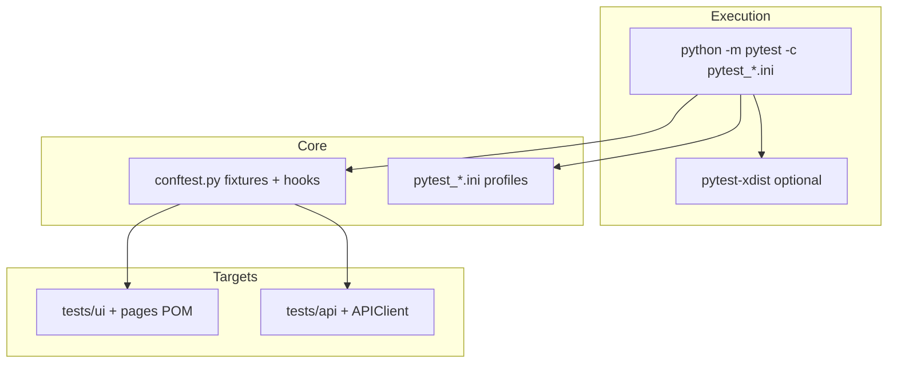

# Test Plan — Notes Practice Application (UI & API Automation)

**Document type:** Enterprise QA automation test plan & execution strategy  
**Application under test (AUT):** Expand Testing **Notes** — web UI + REST API (`practice.expandtesting.com`, URLs in `config/config.ini`)  
**Automation repository:** Pytest-based framework (this project)  
**Related engineering docs:** [FRAMEWORK_ARCHITECTURE.md](FRAMEWORK_ARCHITECTURE.md) · [PROJECT_DETAILED_EXPLANATION.md](PROJECT_DETAILED_EXPLANATION.md) · [TEST_CASE_DETAILED_EXPLANATION.md](TEST_CASE_DETAILED_EXPLANATION.md) · [MOCK_INTERVIEW_PREP.md](MOCK_INTERVIEW_PREP.md) · [notes_handbook.md](notes_handbook.md)

**Document control**

| Field | Value |
|-------|--------|
| **Test inventory** | **75** automated tests (**25 UI**, **50 API**) |
| **Primary runner** | pytest (invoke as `python -m pytest` for environment consistency) |
| **Last alignment** | Synchronized with `pytest_*.ini`, `conftest.py`, `pages/`, `tests/`, and stability batch scripts |

---

## 1. Executive summary

This test plan defines the **scope**, **objectives**, **execution strategy**, **environments**, **reporting**, and **risk posture** for automated validation of the **Notes** practice application. The automation suite comprises **75** tests executed via **pytest** with **separate configuration profiles** for UI-only, API-only, full regression, and **stability** (parallel without reruns). The framework employs **Selenium 4** with **Page Object Model** for UI, a **session-based HTTP client** with **response normalization** for API tests, **pytest-xdist** for parallelism, **pytest-html** for self-contained HTML evidence, and **centralized logging** plus **failure screenshots** for UI defects.

The approach acknowledges **real-world UI complexity** (React SPA, third-party overlays) through **defensive waits**, **overlay mitigation**, and a **documented hybrid strategy** where **note persistence** is established via **REST** for reliability while **UI state** remains the primary user-facing assertion surface for most Notes scenarios.

---

## 2. Project overview

| Dimension | Description |
|-----------|-------------|
| **AUT** | Expand Testing **Notes** — login, registration, notes CRUD (UI); user and notes REST API (HTTP) |
| **UI coverage** | **25** tests across `tests/ui/` — Login, Register, Notes |
| **API coverage** | **50** tests across `tests/api/` — Auth (`test_auth_api.py`), Notes (`test_notes_api.py`), User/account (`test_user_api.py`) |
| **Technologies** | Python **3.10+** (recommended), pytest, Selenium 4, requests, pytest-xdist, pytest-html, pytest-rerunfailures, webdriver-manager, configparser |
| **Architecture summary** | Fixtures and hooks in root **`conftest.py`**; POM under **`pages/`**; HTTP wrapper **`utilities/api_client.py`** with **`_ResponseProxy`**; configuration **`config/config.ini`** |
| **Markers** | `smoke`, `regression`, `positive`, `negative`, `ui`, `api` — used for selective execution (`-m`) |

---

## 3. Objectives

| ID | Objective |
|----|-----------|
| O-1 | **Regression:** Detect breaking changes in critical UI flows (authentication, registration, notes) and corresponding API contracts. |
| O-2 | **Fast feedback:** Support **parallel execution** (xdist) for reduced wall-clock time on full and partial suites. |
| O-3 | **Evidence:** Produce **audit-ready artifacts** — timestamped HTML reports, pytest text logs, framework logs, and UI failure screenshots. |
| O-4 | **Stability measurement:** Provide a **stability profile** that runs the full **75** tests under parallelism **without reruns** to avoid masking intermittent defects. |
| O-5 | **Maintainability:** Centralize locators in POM, centralize URLs/credentials in configuration, and document per-test behavior in **`TEST_CASE_DETAILED_EXPLANATION.md`**. |

---

## 4. Scope

### 4.1 In scope

- **Functional UI testing** of Notes web app: login, register, notes (create, list visibility, delete, edit, validation, multi-note, refresh persistence).
- **Functional API testing** of Notes REST endpoints: user lifecycle (register, login, profile, logout, password change where applicable), notes CRUD, categories, completion toggle, boundary cases, and selected negative paths.
- **Non-functional (limited):** basic **parallelism** and **repeat-run stability** evidence via configured profiles and batch scripts; **headless** browser execution for CI-style runs.
- **Configuration-driven** execution (browser, headless, timeouts, credentials).

### 4.2 Out of scope

- Performance / load / stress testing of the practice hosts.
- Formal security assessment (penetration testing, OWASP ASVS audit).
- Native mobile app automation.
- Accessibility (WCAG) conformance as a primary gate.
- Visual regression / pixel-diff testing (not implemented).
- Multi-tenant production environments beyond the **designated practice URLs**.

---

## 5. Automation strategy

| Strategy | Description |
|----------|-------------|
| **UI** | **POM** (`pages/`), **explicit waits** (`WebDriverWait`), **overlay dismissal** (`_dismiss_overlays`), **JS clicks** where interception occurs, **eager** page load + **`_wait_for_react_ready`** for React hydration. |
| **API** | **Arrange–Act–Assert** tests using **`APIClient`**; **`auth_token`** fixture for authenticated calls; status-first assertions then JSON fields; **`_ResponseProxy`** aligns nested `data` payloads with legacy-style assertions. |
| **Hybrid (Notes UI)** | **`NotesPage.save_note()`** defaults to **API-backed creation** + UI sync; **empty-title** path remains **UI-submitted** to exercise client validation. Documented in architecture and notes handbook. |
| **Smoke** | Marker-driven subset for fast confidence (see `pytest -m smoke` on UI/API collections). |
| **Regression** | Full `tests/ui` or `tests/api` or combined `tests` per profile. |
| **Stability** | `pytest_stability.ini`: **75** tests, **`-n 4`**, **no `--reruns`**; optional **10×** batch executions and summary generation (`utilities/generate_stability_report.py`, `run_10_times_api-ui.bat`, etc.). |

---

## 6. Framework architecture summary



**Key runtime behaviors**

- **`pytest_configure`:** timestamped **`reports/<prefix>_report_<ts>.html`** and **`reports/<prefix>_log_<ts>.txt`**. Prefix is derived from the active config filename (e.g. `pytest_api.ini` → **`api`**, `pytest_ui.ini` → **`ui`**, `pytest_stability.ini` → **`stability`**, `pytest_all.ini` → **`all`**). Root **`pytest.ini`** yields an **empty** prefix (filenames begin with **`_report_`** / **`_log_`**); prefer **`-c pytest_all.ini`** for full-suite runs with a clear **`all_`** artifact name.
- **`python utilities/run_tests.py all`:** passes **`--html=reports/full_report_<timestamp>.html`** (see `utilities/run_tests.py`) — a distinct naming convention from the **`all_report_`** pattern produced by **`python -m pytest -c pytest_all.ini`** when HTML is injected only by **`pytest_configure`**.
- **`driver`:** function-scoped WebDriver; screenshot on **call** failure; always **`quit()`**.
- **`auth_token`:** **function-scoped**; obtains token via **`APIClient.post("users/login", …)`** each test.

---

## 7. Test environment

| Item | Specification |
|------|----------------|
| **Python** | **3.10 or newer** recommended (align virtualenv with `python -m pytest`). |
| **OS** | Windows (primary scripts: `.bat`); macOS/Linux supported for core pytest (`run_tests.sh`, `run_all_10_times.sh`). |
| **Browsers (UI)** | **Google Chrome** and **Mozilla Firefox** (configured in `config.ini` or overridden with `--browser=chrome|firefox`). |
| **Drivers** | **webdriver-manager** — automatic driver resolution (no checked-in chromedriver binaries). |
| **Headless** | `[browser] headless = true|false` in `config/config.ini`; Chrome uses `--headless=new` with common stability flags when enabled. |
| **Network** | Outbound HTTPS to `practice.expandtesting.com` and driver CDN endpoints. |
| **Test data** | Credentials and URLs from **`config/config.ini`**; unique emails/titles generated in tests/helpers; optional JSON under **`testdata/`**. |

---

## 8. Test execution strategy

### 8.1 Command convention

Always invoke pytest as:

```bash
python -m pytest <arguments>
```

This ensures the **same interpreter** that owns installed packages runs pytest (avoids PATH mismatches).

### 8.2 Primary profiles

| Profile | Command (example) | Role |
|---------|---------------------|------|
| **UI** | `python -m pytest -c pytest_ui.ini --no-header -q -n 4` | **25** UI tests; **`pytest_ui.ini`** adds **`--reruns 1 --reruns-delay 2`** only — **`-n 4`** is passed on the CLI (not in the ini) for parallel UI |
| **API** | `python -m pytest -c pytest_api.ini --no-header -q` | **50** API tests; **`pytest_api.ini`** adds reruns only — add **`-n <N>`** on the CLI if parallel API execution is approved |
| **Stability (full 75)** | `python -m pytest -c pytest_stability.ini --no-header -q` | **75** tests; ini includes **`-n 4`**; **no reruns** |
| **Full regression** | `python -m pytest -c pytest_all.ini --no-header -q` | Combined **75** tests; **`pytest_all.ini`** includes **`-n auto`** and **`--reruns 1 --reruns-delay 2`** (root **`pytest.ini`** is equivalent for `testpaths` + `addopts`) |

### 8.3 Parallelism & reruns

| Mechanism | Behavior |
|-----------|----------|
| **pytest-xdist** | Worker **processes** isolate fixtures; UI = one browser **per test per worker**. |
| **`-n auto`** | `pytest_all.ini` / default `pytest.ini` — maximize throughput (watch CPU and SaaS limits). |
| **`-n 4`** | `pytest_stability.ini` and common UI batch guidance — balance speed vs browser stability. |
| **pytest-rerunfailures** | Present on **UI/API** profiles; **absent** on **stability** profile to expose intermittent failures. |

### 8.4 Reports, logs, screenshots

| Artifact | Mechanism | Location |
|----------|-----------|----------|
| **HTML report** | pytest-html; path set in **`pytest_configure`** unless overridden | `reports/<prefix>_report_<timestamp>.html` (self-contained) |
| **Pytest text log** | `log_file` injected in **`pytest_configure`** | `reports/<prefix>_log_<timestamp>.txt` |
| **Framework log** | `utilities/logger.py` | `logs/test_<YYYY-MM-DD>.log` |
| **Failure screenshots (UI)** | `driver` fixture after failed **call** | `reports/screenshots/<test_function_name>.png` |
| **Stability batch outputs** | `.bat` / `.sh` wrappers | e.g. `reports/api/`, `reports/ui/`, summary `.txt` / `.md` |

### 8.5 Optional launcher

```bash
python -m utilities.run_tests ui
python -m utilities.run_tests api
python -m utilities.run_tests stability
python -m utilities.run_tests all
```

---

## 9. Test case inventory

**Legend:** **Priority** derived from markers (`smoke` = higher scheduling priority in typical teams). **Stability risk:** Low (L) / Medium (M) / High (H) — see **§10** for factors. **Automation status:** Automated (A).

### 9.1 UI tests (`tests/ui/`) — 25

| Test ID | Test function | Feature | Priority | Type | Automation | Stability risk | Remarks |
|---------|---------------|---------|----------|------|--------------|----------------|---------|
| UI-01 | `test_valid_login` | Login | Smoke | Positive | A | M | Config credentials; overlay-sensitive |
| UI-02 | `test_invalid_password` | Login | Regression | Negative | A | M | Error toast / alert locators |
| UI-03 | `test_invalid_username` | Login | Regression | Negative | A | M | URL + success assertion |
| UI-04 | `test_empty_username` | Login | Regression | Negative | A | M | |
| UI-05 | `test_empty_password` | Login | Regression | Negative | A | M | |
| UI-06 | `test_both_fields_empty` | Login | Regression | Negative | A | M | |
| UI-07 | `test_login_page_title` | Login | Regression | Positive | A | L | URL smoke |
| UI-08 | `test_login_redirects_to_notes` | Login / redirect | Smoke | Positive | A | M | |
| UI-09 | `test_logout_after_login` | Logout | Smoke | Positive | A | H | Notes SPA + `NotesPage.logout` |
| UI-10 | `test_invalid_email_format` | Login | Regression | Negative | A | M | Explicit `WebDriverWait` on error |
| UI-11 | `test_successful_registration` | Register | Regression | Positive | A | M | Unique email |
| UI-12 | `test_mismatched_passwords` | Register | Regression | Negative | A | M | |
| UI-13 | `test_empty_name_field` | Register | Regression | Negative | A | M | |
| UI-14 | `test_empty_email_field` | Register | Regression | Negative | A | M | |
| UI-15 | `test_short_password` | Register | Regression | Negative | A | M | |
| UI-16 | `test_already_registered_email` | Register | Regression | Negative | A | M | Depends on config email state |
| UI-17 | `test_register_page_loads` | Register | Regression | Positive | A | L | |
| UI-18 | `test_valid_email_format_check` | Register | Regression | Positive | A | L | Light field smoke |
| UI-19 | `test_create_note` | Notes | Smoke | Positive | A | H | Hybrid API/UI save |
| UI-20 | `test_note_appears_in_list` | Notes | Smoke | Positive | A | H | Title visibility |
| UI-21 | `test_delete_note` | Notes | Regression | Positive | A | H | Deletes **first** note if no title — see maintainer note |
| UI-22 | `test_edit_note` | Notes | Regression | Positive | A | H | UI path + API fallback |
| UI-23 | `test_empty_note_title` | Notes | Regression | Negative | A | M | UI validation branch |
| UI-24 | `test_multiple_notes` | Notes | Regression | Positive | A | H | Two-note visibility |
| UI-25 | `test_note_persists_after_refresh` | Notes | Smoke | Positive | A | H | Refresh + React wait |

### 9.2 API tests — 50

#### Block A — `tests/api/test_auth_api.py` (12)

| Test ID | Test function | HTTP | Resource (relative to `api_base_url`) | Type | Automation | Stability risk | Remarks |
|---------|----------------|------|----------------------------------------|------|--------------|----------------|---------|
| API-01 | `test_register_user_success` | POST | `users/register` | Positive | A | L | UUID email |
| API-02 | `test_register_duplicate_email` | POST | `users/register` | Negative | A | L | |
| API-03 | `test_register_missing_email` | POST | `users/register` | Negative | A | L | |
| API-04 | `test_register_missing_password` | POST | `users/register` | Negative | A | L | |
| API-05 | `test_login_success` | POST | `users/login` | Positive | A | L | Smoke |
| API-06 | `test_login_wrong_password` | POST | `users/login` | Negative | A | L | |
| API-07 | `test_login_invalid_email` | POST | `users/login` | Negative | A | L | |
| API-08 | `test_get_profile_success` | GET | `users/profile` | Positive | A | L | Fresh user in test |
| API-09 | `test_get_profile_no_token` | GET | `users/profile` | Negative | A | L | |
| API-10 | `test_get_profile_invalid_token` | GET | `users/profile` | Negative | A | L | Asserts error signal |
| API-11 | `test_logout_success` | DELETE | `users/logout` | Positive | A | M | Uses **`auth_token`** (shared user) |
| API-12 | `test_logout_no_token` | DELETE | `users/logout` | Negative | A | L | |

#### Block B — `tests/api/test_notes_api.py` (25)

| Test ID | Test function | HTTP | Resource | Type | Automation | Stability risk | Remarks |
|---------|----------------|------|----------|------|--------------|----------------|---------|
| API-13 | `test_create_note_success` | POST | `notes` | Positive | A | L | Fresh user helper |
| API-14 | `test_create_note_missing_title` | POST | `notes` | Negative | A | M | `auth_token` user |
| API-15 | `test_create_note_missing_description` | POST | `notes` | Negative | A | L | Fresh user |
| API-16 | `test_create_note_no_auth` | POST | `notes` | Negative | A | L | |
| API-17 | `test_get_all_notes` | GET | `notes` | Positive | A | L | |
| API-18 | `test_get_all_notes_no_auth` | GET | `notes` | Negative | A | L | |
| API-19 | `test_get_note_by_id` | GET | `notes/{id}` | Positive | A | L | |
| API-20 | `test_get_note_invalid_id` | GET | `notes/{id}` | Negative | A | M | |
| API-21 | `test_get_note_no_auth` | GET | `notes/{id}` | Negative | A | M | |
| API-22 | `test_update_note_success` | PUT | `notes/{id}` | Positive | A | M | |
| API-23 | `test_update_note_missing_title` | PUT | `notes/{id}` | Negative | A | L | |
| API-24 | `test_update_note_no_auth` | PUT | `notes/{id}` | Negative | A | M | |
| API-25 | `test_update_note_invalid_id` | PUT | `notes/{id}` | Negative | A | M | |
| API-26 | `test_delete_note_success` | DELETE | `notes/{id}` | Positive | A | H | Mutates shared user notes |
| API-27 | `test_delete_note_no_auth` | DELETE | `notes/{id}` | Negative | A | M | |
| API-28 | `test_delete_note_invalid_id` | DELETE | `notes/{id}` | Negative | A | M | |
| API-29 | `test_create_multiple_notes` | POST/GET | `notes` | Positive | A | L | Isolated new user |
| API-30 | `test_note_category_home` | POST | `notes` | Positive | A | M | Category enum |
| API-31 | `test_note_category_work` | POST | `notes` | Positive | A | M | |
| API-32 | `test_note_category_personal` | POST | `notes` | Positive | A | M | |
| API-33 | `test_toggle_note_complete` | PATCH | `notes/{id}` | Positive | A | L | |
| API-34 | `test_toggle_note_incomplete` | PATCH | `notes/{id}` | Positive | A | L | |
| API-35 | `test_note_title_max_length` | POST | `notes` | Boundary | A | M | Accepts 200 or 400 |
| API-36 | `test_update_only_description` | POST/PUT | `notes`, `notes/{id}` | Positive | A | H | Asserts nested `data` — sensitive to proxy shape |
| API-37 | `test_delete_all_notes` | GET/DELETE | `notes` | Positive | A | **H** | Wipes **all** notes for **`auth_token`** user |

#### Block C — `tests/api/test_user_api.py` (13)

| Test ID | Test function | HTTP | Resource | Type | Automation | Stability risk | Remarks |
|---------|----------------|------|----------|------|--------------|----------------|---------|
| API-38 | `test_update_profile_success` | PATCH | `users/profile` | Positive | A | M | `auth_token` |
| API-39 | `test_update_profile_no_auth` | PATCH | `users/profile` | Negative | A | L | |
| API-40 | `test_change_password_success` | POST | `users/change-password` | Positive | A | H | New user helper |
| API-41 | `test_change_password_wrong_old` | POST | `users/change-password` | Negative | A | L | |
| API-42 | `test_change_password_mismatch` | POST | `users/change-password` | Negative | A | M | Allows 200 or 400 |
| API-43 | `test_get_profile_after_update` | PATCH/GET | `users/profile` | Positive | A | M | |
| API-44 | `test_login_after_password_change` | POST | `users/change-password`, `users/login` | Positive | A | H | Loose status assertion |
| API-45 | `test_access_after_logout` | DELETE/GET | `users/logout`, `users/profile` | Negative | A | L | |
| API-46 | `test_register_empty_name` | POST | `users/register` | Negative | A | L | |
| API-47 | `test_create_note_after_relogin` | POST | `users/login`, `notes` | Positive | A | M | Double login |
| API-48 | `test_profile_fields_present` | GET | `users/profile` | Positive | A | M | Schema-style assert |
| API-49 | `test_note_response_fields` | POST | `notes` | Positive | A | M | |
| API-50 | `test_delete_account` | DELETE | `users/delete-account` | Positive / Conditional | A | H | **Skip** on **404** if unsupported |

**Header contract (API):** authenticated calls use header **`x-auth-token: <token>`** (see tests and `APIClient` merged headers).

---

## 10. Coverage analysis

| Area | Covered | Gaps / limitations |
|------|---------|-------------------|
| **UI auth** | Valid/invalid login, empty fields, redirect, logout | Not every HTML5 edge case exhaustively enumerated |
| **UI register** | Happy path + common negatives | No captcha / email verification flows |
| **UI notes** | Create, list, delete, edit, validation, multi, refresh | `test_delete_note` may not delete the intended card without title scoping |
| **API auth** | Register, login, profile, logout, token errors | OAuth / SSO not applicable |
| **API notes** | CRUD, list, authz negatives, categories, PATCH completed, bulk delete | `test_delete_all_notes` is destructive on shared account |
| **API user** | Profile patch, password flows, post-logout access, delete account (conditional) | Some assertions intentionally loose (`login_after_password_change`) |
| **Cross-layer** | Same business rules exercised in UI and API | **Dual HTTP stacks** (`APIClient` vs `NotesPage` `requests`) must stay aligned manually |

**Shared-state concerns:** `auth_token` uses **config user**; parallel **DELETE**/**mass delete** tests can collide with UI tests using the same account.

**Flakiness mitigation (Notes UI):** `_wait_for_react_ready`, `_dismiss_overlays`, JS clicks, **API-backed** `save_note`, **GET /notes** fallback in visibility helpers, removal of test-level **`implicitly_wait(0)`** anti-pattern (see `tests/ui/test_notes.py` header).

---

## 11. Stability execution strategy

| Principle | Implementation |
|-----------|------------------|
| **No reruns** | `pytest_stability.ini` **omits** `pytest-rerunfailures` options — failures are **real** for that run |
| **Parallelism** | **`addopts = -n 4`** — balances throughput with UI/browser stability on practice infrastructure |
| **Full suite** | **`testpaths = tests`** — **75** tests (25 UI + 50 API) per `python -m pytest -c pytest_stability.ini --collect-only` |
| **Repeated runs** | Windows **`run_10_times_api-ui.bat`**: e.g. API runs with **`-n 8`**, UI with **`-n 4`** per iteration; summaries under `reports/` |
| **Alternate strategy** | **`run_stability_10x.bat`**, **`run_all_10_times.bat` / `.sh`** with `utilities/run_tests.py` + `generate_stability_report.py` |
| **Evidence** | Timestamped HTML + logs; batch folders `reports/api/`, `reports/ui/` where applicable |

**Why reruns exist on non-stability profiles:** reduce **noise** from transient network or practice-host blips during day-to-day development — distinct from **stability governance**, which must not auto-retry.

---

## 12. Reporting & logging strategy

| Layer | Tool | Consumer |
|-------|------|----------|
| **Test result (human)** | pytest-html self-contained files | QA leads, release managers |
| **Test result (machine)** | pytest exit code | CI gates |
| **Diagnostics** | pytest `log_file`, `log_cli` | Engineers triaging failures |
| **Application-style tracing** | `get_logger()` | Cross-cutting timeline in `logs/test_<date>.log` |
| **UI forensics** | PNG screenshots on failed **call** | Defect attachments (Jira / ADO) |

**Naming:** Timestamp pattern `YYYY-MM-DD_HH-MM-SS` in `pytest_configure` prevents accidental overwrite of prior evidence.

---

## 13. Risks & mitigations

| Risk | Impact | Mitigation |
|------|--------|------------|
| **Third-party overlays / ads** | Click interception, obscured elements | `_dismiss_overlays`, JS click, scroll-into-view, hybrid API path for Notes |
| **React hydration timing** | Assertions on empty shell DOM | `_wait_for_react_ready`, eager load strategy, avoid `implicitly_wait(0)` in tests |
| **Shared practice account** | Parallel tests collide on data | Prefer isolated users in API tests where implemented; run destructive tests serially; document `test_delete_all_notes` |
| **Practice API instability** | Intermittent 5xx | Reruns on dev profiles; stability metrics without reruns; retry ticket to host owner |
| **High xdist fan-out** | CPU/RAM exhaustion; too many browsers | Cap workers (`-n 4` UI); scale agents horizontally in CI |
| **Flaky tests** | Trust erosion | Stability profile + trend tracking; quarantine chronic flakes |
| **Browser/driver crash** | Lost session | Failure screenshot may be partial; re-run single test with `-vv` |

---

## 14. CI/CD readiness

| Platform | Readiness |
|----------|-----------|
| **Jenkins / Azure DevOps** | Run `python -m pytest -c pytest_stability.ini` (or split UI/API jobs); archive `reports/` and `logs/`; set `headless=true`. |
| **GitHub Actions** | Matrix: Python version × browser; upload artifacts from `reports/`; cache pip + webdriver-manager downloads. |
| **Docker** | Container with Chrome/Firefox + matching driver strategy; entrypoint runs `python -m pytest` with chosen `-c`. |
| **Selenium Grid** | Not wired in code today — extend `conftest.py` with `webdriver.Remote` when enterprise requires centralized browsers. |
| **Cloud browser farms** | Same pytest command with remote capabilities (Sauce, BrowserStack, etc.). |

---

## 15. Entry & exit criteria

### 15.1 Entry criteria (run may start)

- Python environment created; **`python -m pip install -r requirements.txt`** completed successfully.
- `config/config.ini` populated with reachable **`[urls]`** and valid **`[api]`** credentials for tests that require them (otherwise **expected skips** on some UI tests).
- Network path to AUT available from runner.

### 15.2 Exit criteria (release / sign-off quality gate — example)

| Gate | Example criterion |
|------|-------------------|
| **Functional** | **0** failed tests on **`pytest_ui.ini`** and **`pytest_api.ini`** for candidate build |
| **Stability** | **≥ 95%** pass rate across **10** consecutive **`pytest_stability.ini`** runs **or** zero **unique** failures after triage — **adjust per org policy** |
| **Evidence** | HTML + logs retained per run with build id correlation |
| **Defects** | No open **P1** defects without documented waiver |

*(Tune numeric stability targets with your release governance.)*

---

## 16. Defect management strategy

| Artifact | Use in defect report |
|----------|----------------------|
| **HTML report** | Link or attach `*_report_*.html` — shows timeline and outcome |
| **Pytest log** | `*_log_*.txt` — DEBUG-level detail |
| **Framework log** | `logs/test_<date>.log` — POM + API client breadcrumbs |
| **Screenshot** | `reports/screenshots/<test>.png` for UI call failures |
| **Repro command** | Exact `python -m pytest -c … ::nodeid` with `-n0` if parallel-related |

---

## 17. Maintenance strategy

| Area | Action |
|------|--------|
| **Locators** | Update **`pages/*.py`** only; run affected UI tests + smoke |
| **API contract** | Update **`APIClient`** / assertions when Swagger changes; watch **`_ResponseProxy`** assumptions |
| **Configuration** | Version-control template; keep secrets out of public forks |
| **Dependencies** | Periodic `python -m pip list --outdated`; pin in future `requirements.lock` if needed |
| **Stability monitoring** | Weekly **`pytest_stability.ini`** + trend dashboard |

---

## 18. Future improvements

| Item | Benefit |
|------|---------|
| **Allure** or similar | Rich timelines, categories, attachments standard across orgs |
| **Dockerized agents** | Reproducible CI browsers |
| **Selenium Grid / cloud** | Scale parallel UI without local RAM ceiling |
| **Visual / Percy-style testing** | Catch unintended CSS/React regressions |
| **Contract testing** | JSON Schema / Pact against Notes API |
| **Performance smoke** | k6/Locust for a few critical endpoints |

---

## Appendix A — Traceability

| Document | Purpose |
|----------|---------|
| [TEST_CASE_DETAILED_EXPLANATION.md](TEST_CASE_DETAILED_EXPLANATION.md) | Per-test encyclopedia (inventory mirrors this plan) |
| [FRAMEWORK_ARCHITECTURE.md](FRAMEWORK_ARCHITECTURE.md) | Engineering architecture & risks |
| [notes_handbook.md](notes_handbook.md) | Notes UI / `NotesPage` maintainer handbook |

---

*This test plan reflects the current automated suite: **75** tests (**25** UI + **50** API), `python -m pytest` execution, fixture scopes and hybrid Notes strategy as implemented in the repository.*
